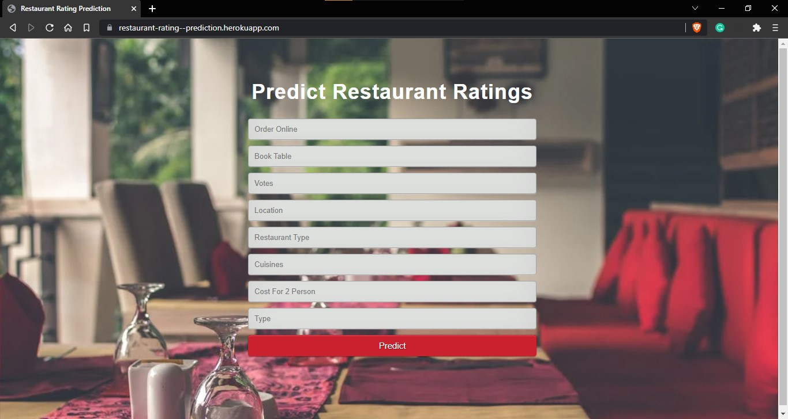
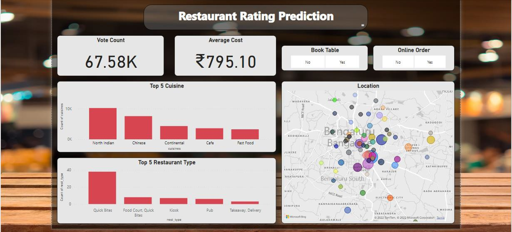

# Restaurant Rating Prediction

This is a C-DAC project work submitted for completion of Post Graduation Diploma in Big Data Analytics Course.

---

The model was succefully deployed on AWS as well as Heroku.

Link : https://restaurant-rating--prediction.herokuapp.com/

---
The most commonly used parameter for judging a restaurant is the rating. In spite of increasing demand, it becomes difficult for new restaurants to compete with the well-established restaurants. Various factors come into the picture in determining the success of a restaurant and affect its ratings.

This model helps the restaurants to plan their statregies based on location, cuisine, cost and various other factor by giving predictive restaurant rating.

---

## Dataset Information: 

#### [Download Dataset](https://www.kaggle.com/datasets/himanshupoddar/zomato-bangalore-restaurants)

The dataset contains 57,717 rows and 17 columns.

Data is available in .csv format. Dataset columns are as follows,
Dataset Columns with description

- url: contains the url of the restaurant
- address: contains the address of the restaurant in Bengaluru
- name: contains the name of the restaurant
- online_order: whether online ordering is available in the restaurant or not
- book_table: table book option available or not
- rate: contains the overall rating of the restaurant out of 5
- votes: contains total number of ratings for the restaurant as of the above-mentioned rate
- phone: contains the phone number of the restaurant
- location: contains the neighbourhood in which the restaurant is located
- rest_type: restaurant type
- dish_liked: dishes people liked in the restaurant
- cuisines: food styles, separated by comma
- approx_cost(for two people): contains the approximate cost for meal for two people
- reviews_list: list of tuples containing reviews for the restaurant, each tuple
- menu_item: contains list of menus available in the restaurant
- listed_in(type): type of meal 
- listed_in(city): contains the neighbourhood in which the restaurant is listed

## Pre-processing
The Dataset contained 17 Attributes.
- Records with duplicate values were dropped from the dataset and records with null values were replaced with a mean value.
- Values in the ‘Rating’ column were changed. The ‘/5’ string was deleted. For eg. If the rating of a restaurant was 3.5/5, it was changed to 3.5.
- Using LabelEncoding from sklearn library, encoding was done on columns like book_table,online_order,rest_type,listed_in(city).

### Feature Selection
We did not use any feature selection algorithms but eliminated some columns due to available domain knowledge and thorough study of the system.

Dropped columns mentioned below:

- URL
- Phone

The Columns being used are as follows:

- Name
- Online_order
- Book_table
- Address
- Dish_liked
- Votes
- Rest_type
- Menu
- Review_list
- Location
- Cuisine
- Approx. cost of two people
- Listed_in(type)
- Listed_in(city)

### Label Encoding
Below mentioned columns are Categorical features.
- rest_type
- location
- cuisines
- online_order
- book_table

As these are important features and affects the predictor, to used them in machine learning model they need to be label encoded. Here, one-hot encoding technique for featurization.

### Split Data
After the dropping duplicate and null rows as well as irrelevant columns a small section of data were removed from the dataset. Now the dataset has 51674 rows and 15 columns. This dataset is divided into train and test part in the ratio of 80:20 for training the machine learning model as well testing it.

## Algorithm Implementation
Applying Different Machine Learning Model
1. Linear Regression – Linear Regression is the process of finding a line that best fits the data points available on the plot, so that we can use it to predict output values for inputs that are not present in the data set we have, with the belief that those outputs would fall on the line.
2. Random Forest Regression – Random Forest Regression is a supervised learning algorithm that uses ensemble learning method for regression. Ensemble learning method is a technique that combines predictions from multiple machine learning algorithms to make a more accurate prediction than a single model.
3. Extra Tree Regression – An extra-trees regressor, this class implements a meta estimator that fits a number of randomized decision trees (a.k.a. extra-trees) on various sub-samples of the dataset and uses averaging to improve the predictive accuracy and control over-fitting.

## Model Evaluation
In this project, the evaluation metric used to determine the accuracy of the model is R2 score.

## Graphical User Interface (GUI)

### Web App UI
For creating the web app pickle file of the machine learning model is used along with Flask. The Flask is micro-framework which has very little dependency on external libraries used for making machine learning web application.
The structure of the web app is designed using HTML and it is stylised using CSS.

- <b>Homepage</b>
 The homepage shows input option for various factors which affect the restaurant rating. The user has to choose values from the drop-down menu for the feature accordingly. The drop-down menu shows option with an associated value. These values are given as input to the model so it can make predictions. After inputting all the required values, the user has to press on predict button to get rating.

- <b>Result page</b>
 After clicking on the predict button the rating is shown at the bottom of the predict button in white coloured text.

### Microsoft Power BI Dashboard
The Dashboard below shows vote count, average cost, top 5 cuisines, top 5 restaurant type, table booking availability, online order availability and map of location of restaurants showing density of restaurants in a particular area.
By choosing options like Yes/No on book table filter or online order filter the related values like vote count, average cost, top 5 cuisines, top 5 restaurant types and map changes accordingly.

